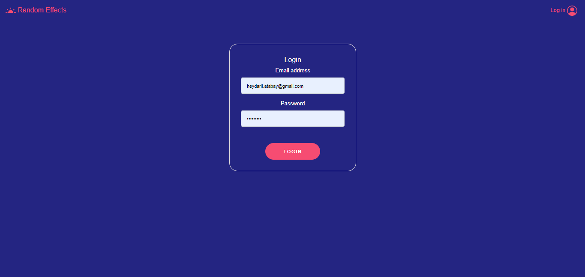
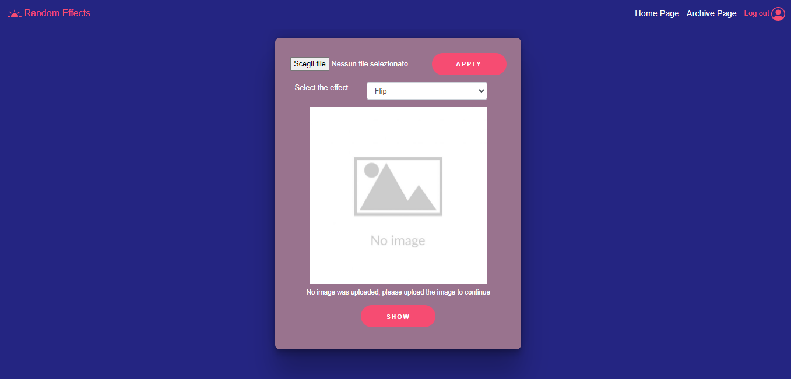
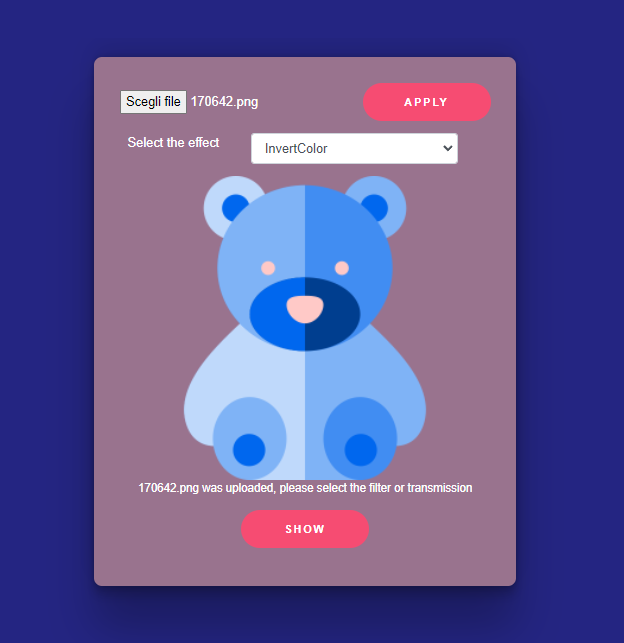

## Developer: Heydarli Atabay
# Random Effect Task

It is a simple web application that allows users to upload a picture in various formats (e.g. jpeg, png). Once the picture is uploaded the user can select zero or multiple effects / transformations on the picture. It is finally possible to download the picture.

The application contains of three components, such as DB(MySQL using AWS RDS Cloud service), backend(NodeJs & Express), and frontend(ReactJS).

## How to run it:

Use these npm scripts to install and run the project: 

1. clone the repository
2. `cd namedirectory`
3. `cd random-effect → npm install`
4. `cd .. → cd server → npm install`
5. (open another terminal window) `cd server nodemon server.js`
6. `cd client → npm start`

The application should now run at [http://localhost:3000](http://localhost:3000/) of the browser

## React Client Application Routes

- Route `/`: redirects to the route: /homepage
- Route `/homepage`: where the main functionality of app was implemented
- Route `/login`: where user can authenticate itself 

## APIs

### login api:
* POST `/api/sessions `
    * Request parameter:
    * Request body: An object representing (Content-Type: `application/json`).
    * Body of the content:
          
          `{
              "id": e.id, 
              "name": e.name, 
               "email": e.email,
              "hash": e.hash, 
         }
         `     
    * Response: `201 OK (success) or 401` 
    * Response body: 

        `{
              "id": e.id, 
              "name": e.name, 
               "email": e.email,
              "hash": e.hash, 
              "role": e.role
      
         }`  or
              
          `{ 'User not found.' } `

### logout api: 
* DELETE `/api/sessions/current `
    * Request parameter:
    * Request body: 
    * Body of the content:
    * Response: 
    * Response body:
    `Logout completed!`

### get effects

- GET `/api/effects` - Getting all effects from DB
  - request parameters: 
  - response body: array with effects(
    {
    "effect_id": 3, 
    "effect_name":"Flip", 
    "effect_description":"Flips selected image", 
    "effect_type":"effect" 
    }
)

### add new effects
- POST `/api/effects`
  - request parameters and request body content : 
 {
    "effect_id": 3, 
    "effect_name":"Flip", 
    "effect_description":"Flips selected image", 
    "effect_type":"effect" 
}
  - response body content : error object or the id of the new form

### delete effects
- DELETE `/api/effects/delete/:effectid` - Deleting the effect
  - request parameters and request body content : params= effectid
  - response body content : `Selected effect with id:${id} was deleted`
    `Error while deleting the effect with id:${id} ` and error object  

### applying effects to an image
- POST `/api/apply/:effect`
  - request parameters and request body content : params: effect
  Where effect can be:
  "Flip","ChangeColor","InvertColor","GrayScale","Blur","Sepia"
 {
    {formData}: all necesary data of image
}
  - response body content : error object or the id of the new form

## Database Tables

- Table `Users` - contains `id` `email` `name` `hash`
- Table `Effects` - contains `effect_id` `effect_name` `effect_description` `effect_type` 
- Table `Images` - contains `image_id` `image` `image_name` `user_id`
## Users Credentials

| Email address             | Password |
| :------------------------ | :------: |
| heydarli.atabay@gmail.com           |  atabay111  |
| federico.pucci@daskell.com | federico1 |

## Screenshots

### Page of non authorized user

### Login Page

### Main Page

### Flip Effect

### Invert Color Effect

